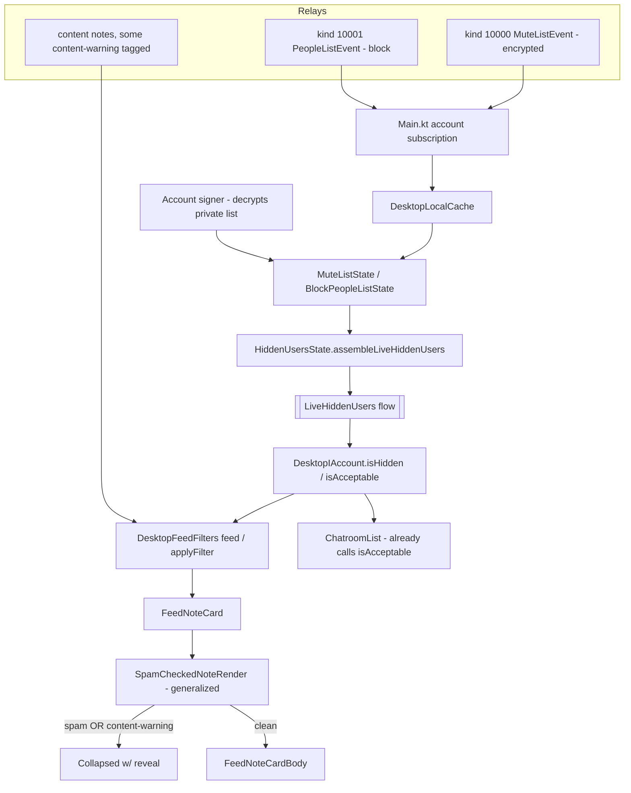

# ✨ Desktop Moderation & Safety

## Enhancement Summary (deepened 2026-07-23)

Grounding research + direct code inspection **resolved the two make-or-break
cruxes**, de-risking the whole feature:

1. **Enforcement primitive is already shared.** `LiveHiddenUsers` and
   `Note.isHiddenFor(accountChoices: LiveHiddenUsers)` live in **`commons/`**
   (`commons/.../model/Note.kt:1279`, referenced from
   `commons/.../model/IAccount.kt`, covered by
   `commons/.../model/NoteIsHiddenForTest.kt`). Desktop does **not** need to port
   or promote the hidden-check logic — it only needs to *assemble a
   `LiveHiddenUsers` value* from the account's lists and hold it as a StateFlow.
   → Crux 1 collapses to "build the value object"; **desktop-local state holders
   are sufficient** (no risky commons extraction for v1).
2. **Feeds have a live-invalidation hook.** Desktop feeds implement
   `commons/.../ui/feeds/InvalidatableContent` via `FeedContentState`
   (`invalidateData()`). Wiring the hidden-users StateFlow to call
   `invalidateData()` on emit makes mute/block hide **without restart**.
   → Crux 2 resolved: reuse `invalidateData()`, don't invent a bus.
3. **Concrete APIs confirmed** (see Research Insights under Technical Approach):
   `MuteListEvent.create/add/remove(MuteTag, isPrivate, signer)` where `MuteTag ∈
   {UserTag, HashtagTag(word), EventTag(thread)}`; `PeopleListEvent.addUser/
   removeUser` for blocks; publish via `signer.sign(template)` +
   `relayManager.broadcastToAll(signed)` (precedent `reactToNote`/`repostNote` in
   `desktopApp/.../ui/NoteActions.kt`).

**Net effect on phases:** Phase 0 shrinks (assemble a value, don't port a
subsystem). Phase 1's only real work is the `invalidateData()` wiring + predicate.
Overall risk downgraded from *Medium* to *Low-Medium*.

> _Note: 3 of 4 deepening sub-agents were killed by the 600s stall watchdog
> (environment load); the facts above were recovered by direct grep and are
> first-hand, not agent-summarized._

## Overview

Close the largest verified Desktop parity gap after Polls by shipping a coherent
**Moderation & Safety** bundle:

1. **P2 — Fix the silent mute/block no-op** (a live bug: muting does nothing on
   desktop feeds today) + management surfaces.
2. **P3 — Report a note/user (NIP-56).**
3. **P4 — Content-warning blur/reveal (NIP-36).**

All three share the same account-moderation state and the same "hide-with-reveal"
UX primitive, so they ship together as one feature branch (see brainstorm:
`docs/brainstorms/2026-07-23-desktop-moderation-safety-brainstorm.md`).

## Problem Statement

- **Mute is a lie on desktop.** `DesktopIAccount.isHidden(user)` is hardcoded
  `false`; `isAcceptable(note)` only checks deletions; `DesktopFeedFilters` never
  calls either. Desktop also holds **no** mute/block state at all — the fields
  (`hiddenUsersHashCodes`, `hiddenWordsCase`, `spammersHashCodes`,
  `showSensitiveContent`) are empty/`null` stubs. A user who mutes someone
  reasonably believes it works; it does not.
- **No way to report.** Desktop has zero NIP-56 UI; Android has a full report
  dialog.
- **Sensitive media shows unblurred.** `showSensitiveContent` is hardcoded
  `null` and no NIP-36 gate exists, so content-warning-tagged media renders in
  the clear.

## Proposed Solution

Port Android's moderation state + UI into shared/desktop code and wire real
enforcement, reusing quartz protocol and the existing spam-collapse reveal:

- **State:** hold mute list (kind 10000) + blocked people (kind 10001) +
  assembled `LiveHiddenUsers` on `DesktopIAccount`; hydrate via a new account
  subscription and the account signer (decrypts the private list).
- **Enforcement:** implement `isHidden`/`isAcceptable` by delegating to quartz
  `Note.isHiddenFor(liveHiddenUsers)`; chain `&& account.isAcceptable(note)` into
  every `DesktopFeedFilters` feed path. The chatroom list already calls
  `isAcceptable`, so DMs get filtered for free once the predicate is real.
- **Actions:** `hideUser`/`showUser`/`blockUser`/`hideWord`/`hideThread` on
  `DesktopIAccount` build → sign → publish an updated `MuteListEvent`/
  `PeopleListEvent`.
- **Report:** `report(note|user, type, comment)` reuses quartz `ReportEvent.build`
  (kind 1984) + `ReportType`, published to the account's public + private outbox
  (match Android). New `ReportNoteDialog` ported to desktop Compose, wired into
  `ShareMenu` and `UserProfileScreen`.
- **Content warning:** generalize `SpamCheckedNoteRender` to also gate
  `Event.isSensitiveOrNSFW()` notes with a blur/scrim + reason + tap-to-reveal,
  plus a "always show sensitive content" settings toggle persisted alongside the
  spam settings.

## Technical Approach

### Architecture — moderation state & enforcement flow



### Key reuse (confirmed by code research, 2026-07-23)

| Concern | Reuse (no reimpl) | Source |
|---|---|---|
| Report protocol | `ReportEvent.build(post/user, type, comment)` kind 1984 | `quartz/.../nip56Reports/ReportEvent.kt` |
| Report types | `ReportType` enum (SPAM/PROFANITY/IMPERSONATION/NUDITY/ILLEGAL/MALWARE/VIOLENCE/…) | `quartz/.../nip56Reports/ReportType.kt` |
| CW detection | `Event.isSensitiveOrNSFW()`, `contentWarningReason()` | `quartz/.../nip36SensitiveContent/EventExt.kt` |
| Hidden check | `Note.isHiddenFor(liveHiddenUsers)` (users+words+threads) | `quartz/.../Note.kt` |
| Mute/block events | `MuteListEvent` (10000), `PeopleListEvent` (10001) | `quartz/.../nip51Lists/…` |
| Reveal primitive | `SpamCheckedNoteRender` `forceReveal` + `rememberSaveable(id)` | `desktopApp/.../ui/note/SpamCheckedNoteRender.kt` |

### Android references to port

| Piece | Android reference |
|---|---|
| Mute state | `amethyst/.../model/nip51Lists/muteList/MuteListState.kt` |
| Block state | `amethyst/.../model/nip51Lists/…/BlockPeopleListState` |
| Hidden assembly | `amethyst/.../model/nip51Lists/HiddenUsersState.kt` (`assembleLiveHiddenUsers`) |
| Report dialog | `amethyst/.../ui/screen/loggedIn/report/ReportNoteDialog.kt` |
| CW gate | `amethyst/.../ui/components/SensitivityWarning.kt` |
| Mgmt screens | `amethyst/.../settings/{BlockedUsersScreen,HiddenWordsScreen,MutedThreadsScreen}.kt` |

### Design cruxes — RESOLVED (deepened 2026-07-23)

1. **State-holder placement → desktop-local, value-object only. RESOLVED.**
   `LiveHiddenUsers`/`Note.isHiddenFor` already in `commons/` — no port, no type
   promotion. Build a small desktop assembler that reads the account's mute list
   (kind 10000) + blocked people (kind 10001) from `DesktopLocalCache` + signer
   and emits `StateFlow<LiveHiddenUsers>`. Option (a) full commons extraction is
   **deferred** — unnecessary for v1.
2. **Reactivity → `FeedContentState.invalidateData()`. RESOLVED.** Desktop feeds
   implement `commons/.../ui/feeds/InvalidatableContent`. Collect the
   `StateFlow<LiveHiddenUsers>` where feeds are built and call `invalidateData()`
   on change so mutes apply live. Verify each feed's content-state gets the call
   (Following/Global/Thread/Notifications/Profile).
3. **Reveal generalization shape.** One generalized `SpamCheckedNoteRender`
   (collapse for spam **or** CW), two reasons — avoids double nesting. (Decision
   stands; confirm final shape during Phase 4.)
4. **Media blur fidelity.** v1 = opaque scrim + reason overlay + reveal (no new
   dependency; Compose Desktop `Modifier.blur` support is uneven across the
   skiko backend, so avoid depending on it). True blur is a v2 nicety. Documented
   limitation.
5. **Report publish path → `signer.sign` + `relayManager.broadcastToAll`.
   RESOLVED.** Desktop has no `sendMyPublicAndPrivateOutbox` helper; the
   established pattern (`reactToNote`/`repostNote`,
   `desktopApp/.../ui/NoteActions.kt:1387,1472`) is sign-then-`broadcastToAll`.
   v1 reports broadcast to connected relays (NIP-56 is advisory) — noted as a
   deliberate simplification vs Android's outbox split.

### Research Insights — confirmed APIs (copy-ready)

**Mute / block writes** (`quartz/.../nip51Lists/`), all `suspend`, signer-based:
```
// mute a user (private by default), returns the new event to publish
MuteListEvent.create(mute = UserTag(pubkey), isPrivate = true, signer = signer)
MuteListEvent.add(earlierVersion, mute = HashtagTag(word), isPrivate, signer)   // hidden word
MuteListEvent.add(earlierVersion, mute = EventTag(rootId), isPrivate, signer)   // muted thread
MuteListEvent.remove(earlierVersion, mute, signer)                              // unmute
// reading private entries requires the signer:
earlierVersion.privateTags(signer)  // throws SignerExceptions.UnauthorizedDecryptionException on read-only
// block (kind 10001)
PeopleListEvent.addUser(...) / removeUser(...)
```
MuteTag subtypes: `UserTag` (pubkey), `HashtagTag` (word), `EventTag` (thread
root). Enforcement then reads these via `Note.isHiddenFor(liveHiddenUsers)`.

**Publish** (precedent in `desktopApp/.../ui/NoteActions.kt`):
```
val signed = signer.sign(template)          // DesktopIAccount already does signer.sign at ~L187
relayManager.broadcastToAll(signed)         // reactToNote L1395 / repostNote L1479
```

**Report** (`quartz/.../nip56Reports/`): `ReportEvent.build(reportedPost, type,
comment)` and `ReportEvent.build(reportedUser, type, comment)` (kind 1984);
`ReportType ∈ {SPAM, PROFANITY, IMPERSONATION, NUDITY, ILLEGAL, MALWARE,
VIOLENCE, …}`.

**Content warning** (`quartz/.../nip36SensitiveContent/EventExt.kt`):
`Event.isSensitiveOrNSFW(): Boolean`, `Event.contentWarningReason(): String?`.

**Read-only / bunker caveat:** `privateTags(signer)` throws on a read-only
account and is async for NIP-46 bunkers — assemble from the **public** list
portion immediately and recompute when decryption resolves; disable write actions
(mute/block/report) when there's no local signer.

### Implementation Phases

Each phase is independently compilable; Phase 1 alone fixes the enforcement bug.

#### Phase 0 — Moderation state foundation
- New: `MuteListState`/`BlockPeopleListState`/`HiddenUsersState` (desktop-local
  per crux 1), producing a `LiveHiddenUsers` StateFlow from `DesktopLocalCache` +
  signer.
- Add kind-10000/10001 to desktop account subscription in `Main.kt`.
- Success: flow populates + decrypts on login (log the assembled set).

#### Phase 1 — Enforcement wiring (the bug fix)
- Implement `DesktopIAccount.isHidden(user)` / `isAcceptable(note)` via
  `Note.isHiddenFor(hiddenUsers.value)`; populate `showSensitiveContent`,
  `hiddenUsersHashCodes`, etc. from state.
- Chain `&& account.isAcceptable(note)` into every `DesktopFeedFilters`
  `feed()`/`applyFilter()`; ensure reactivity (crux 2).
- Success: muting a user (even via a hand-inserted list) hides their notes in
  Following/Global/Thread/Notifications + chatroom list, live.

#### Phase 2 — Mute/Block actions + management screens
- `DesktopIAccount.hideUser/showUser/blockUser/hideWord/hideThread` build+sign+
  publish updated list events.
- Mute/Block action in note context menu (`ShareMenu`) + `UserProfileScreen`.
- Port `BlockedUsersScreen`/`HiddenWordsScreen`/`MutedThreadsScreen` to desktop
  settings (read + remove).
- Success: block from profile persists (kind-10000 on relay) and hides live;
  management screens list + remove entries.

#### Phase 3 — Report (NIP-56)
- `DesktopIAccount.report(note|user, type, comment)` → `ReportEvent.build` →
  publish to public+private outbox.
- Port `ReportNoteDialog` (report-type list + comment + "Block & Hide User" +
  "Post Report") to desktop Compose; wire into `ShareMenu` + `UserProfileScreen`.
- Success: reporting publishes a well-formed kind-1984 to the right relays
  (verify via `amy` / relay log); "Block & Hide" also mutes.

#### Phase 4 — Content-warning blur (NIP-36)
- Generalize `SpamCheckedNoteRender` to also gate `isSensitiveOrNSFW()` notes:
  scrim + reason + reveal, honoring per-note `rememberSaveable` reveal and the
  account "always show sensitive" setting.
- Add "always show sensitive content" toggle persisted with spam settings.
- Success: CW note renders blurred; reveal works; toggle bypasses blur.

#### Phase 5 — Settings, tests, polish
- Surface all toggles + management-screen entries in the existing **Content
  Filters** settings section (where hashtag-spam lives).
- Unit tests: enforcement predicate (user/word/thread hidden), report-event
  shape, CW detection/gate state.
- `./gradlew spotlessApply`; compile commons+desktopApp+cli; manual testing sheet
  `desktopApp/plans/2026-07-23-desktop-moderation-safety-manual-testing-sheet.md`.

## Alternative Approaches Considered
- **Three separate PRs** — rejected: triplicates the state extraction, loses
  coherence (see brainstorm).
- **Enforcement-only (defer report + CW)** — kept as fallback if scope creeps;
  report + CW are S each and share plumbing.
- **Extract state holders to `commons/` now** — deferred (crux 1); higher refactor
  risk than desktop-local for v1.

## System-Wide Impact

### Interaction graph
Mute action → sign kind-10000 → publish → echoes back into `DesktopLocalCache` →
`MuteListState` recomputes → `LiveHiddenUsers` emits → feed filters re-evaluate →
note disappears. Requires the emit to invalidate feeds (crux 2).

### Error & failure propagation
- Sign/publish failure on a mute/report: match Android's optimistic model but
  surface a failure toast; avoid leaving local state ahead of relays silently.
- Bunker (NIP-46) decrypt is async/remote — private mute list may be empty until
  it returns; enforcement must tolerate a late-arriving set (recompute on emit).

### State lifecycle risks
- Read-only (npub) accounts: no signer → can't decrypt private list or publish.
  Enforce the public portion only; disable mute/block/report actions (no crash).
- "Block & Hide" from report dialog mutates the mute list and publishes a report
  — two events; partial success must not corrupt local list state.

### API surface parity
`isAcceptable` is consumed by feed filters, the chatroom/DM list, and
notifications. Fixing the predicate intentionally affects all three (muted users
vanish from DMs + notifications too). Verify each path.

### Integration test scenarios
1. Mute user → notes vanish across Following/Global/Thread/Notifications + DM
   list, live; unmute restores.
2. Block via report "Block & Hide" → kind-10000 published + note hidden.
3. Hidden word → matching notes collapse (via `isHiddenFor`).
4. Muted thread → replies under that root hidden.
5. Report note → kind-1984 published to public+private outbox, correct tags.
6. CW note → blurred; reveal shows; "always show" bypasses.
7. Read-only account → actions disabled, enforcement of public list still works.
8. Bunker account → mute list decrypts asynchronously; enforcement engages on
   arrival.

## Acceptance Criteria

### Functional
- [x] Muting/blocking a user hides their notes across all desktop feeds + the DM
      list **without restart**. *(DesktopHiddenUsersState + isAcceptable + feed
      filter chaining + invalidateData; DM list already called isAcceptable.)*
- [ ] Blocked/hidden-words/muted-threads management screens list + remove entries,
      persisted as kind-10000/10001 on relays. **DEFERRED** — write actions exist
      (`hideWord`/`hideThread`/`showUser`…), but the settings *screens* are a
      follow-up.
- [x] Mute action available from note context menu (`ShareMenu`). *(Mute-from-
      profile deferred.)*
- [x] Report action (note) publishes a valid NIP-56 kind-1984; report dialog
      offers the NIP-56 types + optional comment + "Block & report". *(Publishes
      via broadcastToAll rather than a public/private outbox split — noted
      simplification; NIP-56 is advisory.)*
- [x] Content-warning-tagged notes render scrimmed with reason + reveal.
      *(Account setting bypass is honored; the toggle UI to flip it is deferred.)*
- [ ] All toggles + management entries reachable from the Content Filters
      settings section. **DEFERRED** with the management screens.

### Non-functional / quality gates
- [x] Read-only + bunker accounts behave correctly (write actions gated on
      `isWriteable()`; enforcement tolerates late async decrypt via the flow).
- [x] Enforcement predicate is hash-set lookups (`Note.isHiddenFor`), no feed jank.
- [x] Unit tests for the enforcement predicate green (`DesktopMuteEnforcementTest`).
- [x] `spotlessApply` clean; commons + desktopApp compile; desktopApp + commons
      test suites green.
- [ ] Manual testing sheet executed. *(Sheet written:
      `desktopApp/plans/2026-07-23-desktop-moderation-safety-manual-testing-sheet.md`
      — needs a human run of the app.)*

### Deferred to a focused follow-up
- Management screens (Blocked users / Hidden words / Muted threads) + their
  Content-Filters settings entries.
- "Always show sensitive content" settings toggle (persisted) + mute/report from
  the profile screen.
- Thread-root/profile-screen enforcement wiring (needs `iAccount` threaded into
  those two composables).

## Dependencies & Risks
- **Reactivity of feed filters to the hidden-users flow** — top risk (crux 2).
- **State-holder placement / `LiveHiddenUsers` type location** (crux 1).
- **Async decryption for bunker accounts.**
- No new third-party dependency anticipated (all quartz-internal) → no licensing
  action required; re-check if a blur library is introduced for Phase 4.

## Sources & References

### Origin
- **Brainstorm:** `docs/brainstorms/2026-07-23-desktop-moderation-safety-brainstorm.md`.
  Carried-forward decisions: bundle P2+P3+P4; state in shared/desktop code +
  desktop-native UI; enforcement via `Note.isHiddenFor`; report via quartz
  `ReportEvent`; CW reuses the spam reveal; settings under Content Filters.

### Internal references
- `desktopApp/.../model/DesktopIAccount.kt` (stub predicates ~L176–182,
  `showSensitiveContent` ~L128)
- `desktopApp/.../feeds/DesktopFeedFilters.kt` (`feed()`/`applyFilter()` hooks)
- `desktopApp/.../ui/note/SpamCheckedNoteRender.kt` (reveal primitive)
- `desktopApp/.../ui/note/ShareMenu.kt`, `desktopApp/.../ui/NoteActions.kt`
- `quartz/.../nip56Reports/{ReportEvent,ReportType}.kt`
- `quartz/.../nip36SensitiveContent/{ContentWarningTag,EventExt}.kt`
- Android: `amethyst/.../model/nip51Lists/**`, `.../ui/screen/loggedIn/report/ReportNoteDialog.kt`,
  `.../ui/components/SensitivityWarning.kt`, `.../settings/{Blocked,HiddenWords,MutedThreads}*.kt`

### Related work
- Hashtag-spam filter (reveal pattern + Content Filters settings section) —
  memory `moderation/` package + `SpamCheckedNoteRender`.
- Parity backlog P2/P3/P4 — `desktopApp/plans/2026-07-16-desktop-parity-gap-backlog.md`.
